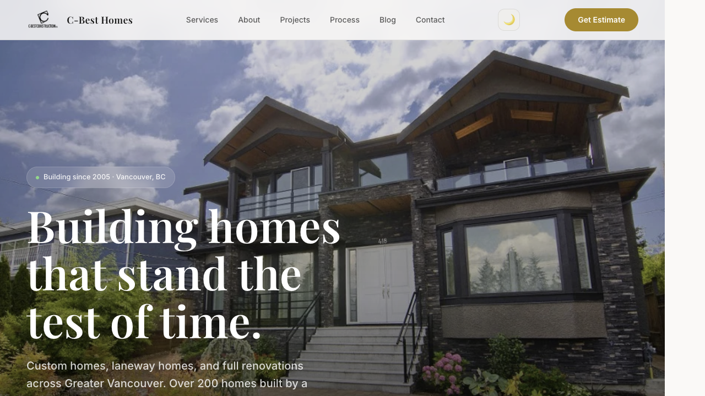
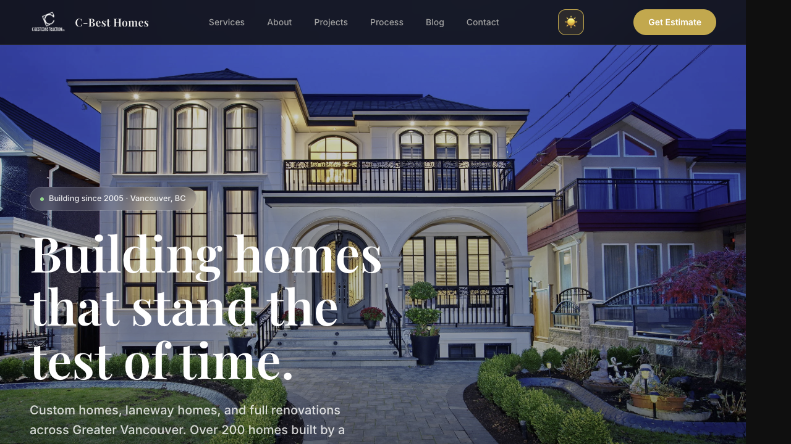
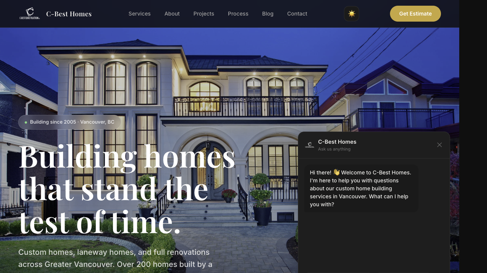

A client needed their Squarespace site rebuilt from scratch — modern design, fast, mobile-first, no monthly CMS fees. I built the entire thing as a single HTML file with zero dependencies.

## What it does

Full business website for a custom home builder in Vancouver. Showcases 7 completed projects with photo galleries, 3 service pages, 8 blog posts, and a contact section with clickable phone/email links. Everything from the old site carried over — nothing lost.

## Highlights

- **Single HTML file** — ~3,100 lines, ~115KB. No build step, no framework, no dependencies
- **Dark mode** — auto-detects system preference, or toggle manually. CSS custom properties handle the theme switch
- **Hero slideshow** — 8 project photos with crossfade transitions, Ken Burns zoom effect, dot indicators, auto-rotation (pauses on hover)
- **Chat bot** — keyword-matched Q&A bot that answers questions about services, pricing, location, and contact info. No backend needed
- **4 modal systems** — project galleries (with keyboard nav + thumbnails), services, blog articles, and privacy policy
- **Accessibility** — `prefers-reduced-motion` support, all images have alt text, `rel="noopener"` on external links
- **SEO** — OpenGraph meta tags, semantic HTML, favicon

## Tech

- HTML / CSS / vanilla JavaScript
- CSS custom properties for theming
- IntersectionObserver for scroll reveal animations
- GitHub Pages for hosting
