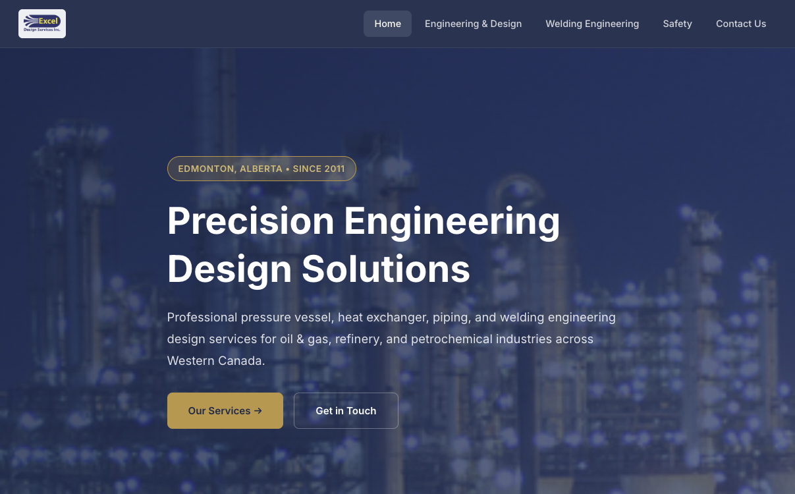

A multi-page business website I built for Excel Design Services Inc., an engineering firm in Edmonton that does pressure vessel, heat exchanger, and piping design.

Originally built in 2022 as a freelance project, then fully redesigned in 2026 when the client came back for a modern refresh — same client, four years later.

## What it does

- Five-page responsive site (home, engineering, welding, safety, contact)
- SEO-optimized with structured data (JSON-LD), meta descriptions, canonical URLs
- Smooth scroll animations and mobile-first navigation
- Professional photo galleries for engineering and welding work

## How it works

Vanilla HTML/CSS/JS — no frameworks, no build step. The client wanted something fast, easy to maintain, and straightforward to host anywhere. Clean static files with modern CSS (Inter font, fluid grid, custom properties).

Built as a freelance project with full design and development — layout, responsive breakpoints, image optimization, and SEO setup.
