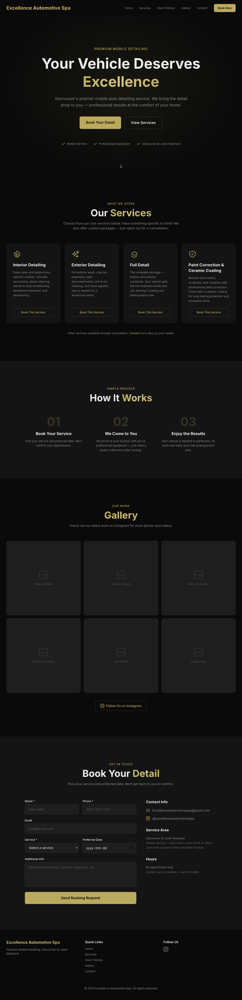

A landing page I built for a mobile car detailing business in Vancouver. The client wanted a sleek dark-themed site with gold accents to match their branding.

## What it does

- Hero section with service highlights and call-to-action
- Service breakdown with pricing tiers
- "How it works" — 3-step booking flow
- Photo gallery (placeholder — waiting on client photos)
- Contact form with mailto fallback

## How it works

Next.js 16 app router with Tailwind CSS for styling. Site config is centralized so the client can update business info in one place. Deployed to Vercel with automatic builds on push.

Built the whole thing in one session as a freelance MVP. Dark background, gold typography, clean sections. The client went quiet after delivery, so it's archived as-is.
